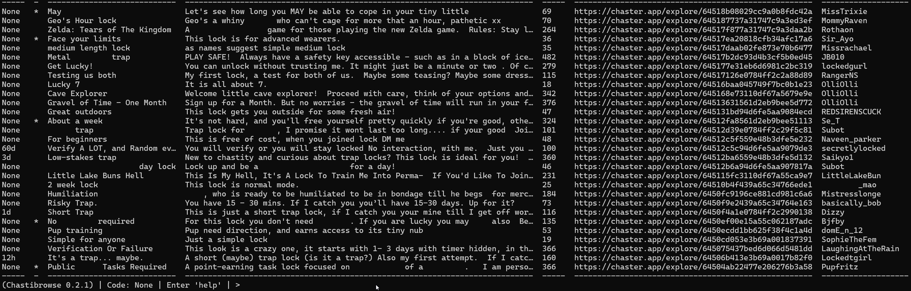

# Chastibrowse

A CLI alternative to [chaster.app](https://chaster.app)'s browse page.

## Features

- Alternative interface to browse public shared locks with improved filtering options.
- A highly customizable table-based display.
- Ease of use & customizability.
- Fully type checked.
- Light on Chaster API.

## Installation

### Build

If you have Python >=3.11 installed, you can simply run `pip install git+https://github.com/CanaSecret/Chastibrowse` to install Chastibrowse.

If you don't have Python 3.11 installed:

- if you're on **Linux** or **MacOS**: you'll need to install a newer version, ideally with a package manager of your choice.
- if you're on **Windows**, you can download Python 3.11 or newer from [python.org](https://www.python.org/downloads/).

### Wheels

There are wheels available under [releases](https://github.com/CanaSecret/Chastibrowse/releases). You'll have to download the version you want and then run `pip install <filename>`.

## Usage

Once installed, can be started by entering 'chastibrowse' in a terminal. Press enter to load more results, or enter help to see all commands.

Taking a look through the **config file** is highly recommended. You can find it by entering 'config' into the input prompt.

Lock data is split into 7 columns by default (can be changed in config):

- Maximum time
- Lock requires Password?
- Title
- Description
- Characters in Description
- Link to Lock
- Keyholder name

Some fields scale with terminal width by default (can be changed in config), but you'll have to enter 'reload' if you resize while Chastibrowse is running.

If you want to customize this, take a look at `config.toml`.

### 'Saving'

The input prompt always provides a 'code'. If you save the last code you see, quit Chastibrowse, open it again and paste the code, you should jump to the place in history where you stopped.

## Planned

- **Done!** ~~Easier results display customisation.~~
- **Done!** ~~Config file validation~~

## Not planned

- **Search**. There's not really a good way to do this without lots of API requests, so will have to wait for an official implementation.
- **GUI** / **WebUI**. I've considered it, but I'm not going to - the command line works just fine.

## Contributing

To contribute, code will have to pass the pre-commit hooks defined in `.pre-commit-config.yaml` (mypy, black, ruff). All dependencies can be installed with the `poetry install --with dev` command. A `ruff.toml` file is included with the code, but I'm potentially open to changes there if needed.

Otherwise, feel free to do whatever you want with the code as long as the license permits it.
